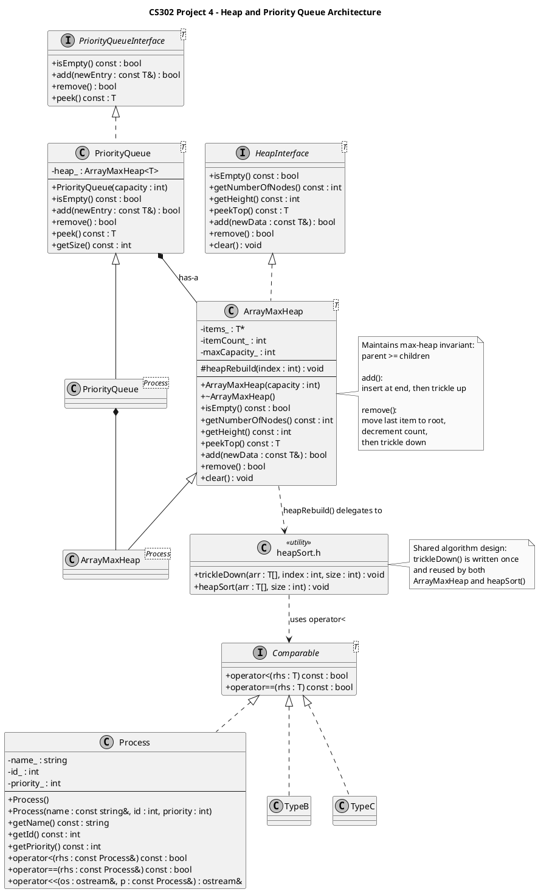

# ADT Design: Heap and Priority Queue

## Purpose

The purpose of this project is to implement a generic max-heap and a priority queue
abstract data type (ADT). The priority queue provides efficient access to the
highest-priority element using a heap-based structure.

This design supports multiple item types (Process, NetworkPacket, PrintJob),
as long as they implement the Comparable interface.

---

## Logical Data Model

The priority queue is logically a collection of items where each item has an
associated priority value.

- Items are not stored in sorted order.
- The only guarantee is that the highest-priority item can be accessed efficiently.
- Internally, the structure is implemented as a complete binary tree.
- The tree is stored in an array representation.

Logical view:
- A tree where each parent node has priority greater than or equal to its children.
- The root node always contains the highest-priority element.

---

## Operations

### isEmpty()
Returns true if the priority queue contains no elements.

### add(newEntry)
Inserts a new item into the queue.
- The item is added at the end of the array.
- The heap property is restored using a "trickle-up" operation.
- Time complexity: O(log n)

### remove()
Removes the highest-priority item (the root).
- The last element replaces the root.
- The heap property is restored using "trickle-down".
- Time complexity: O(log n)

### peek()
Returns (but does not remove) the highest-priority item.
- Time complexity: O(1)

### getSize()
Returns the number of elements currently in the queue.

### clear()
Removes all elements from the queue.

---

## Heap Invariant

The heap maintains the following invariant:

> For every node, its priority is greater than or equal to the priorities of its children.

This ensures:
- The root always contains the maximum element.
- The structure remains a valid max-heap after every insertion and removal.

The heap is also a **complete binary tree**, meaning:
- All levels are fully filled except possibly the last.
- The last level is filled from left to right.

This invariant is preserved by:
- Trickle-up during insertion
- Trickle-down during removal

## UML Diagram

#### Note: Only "Process" is shown in the UML Diagram.  UML for "NetworkPacket" and "PrintJob", which are essentially the same, are omitted for diagram clarity.  