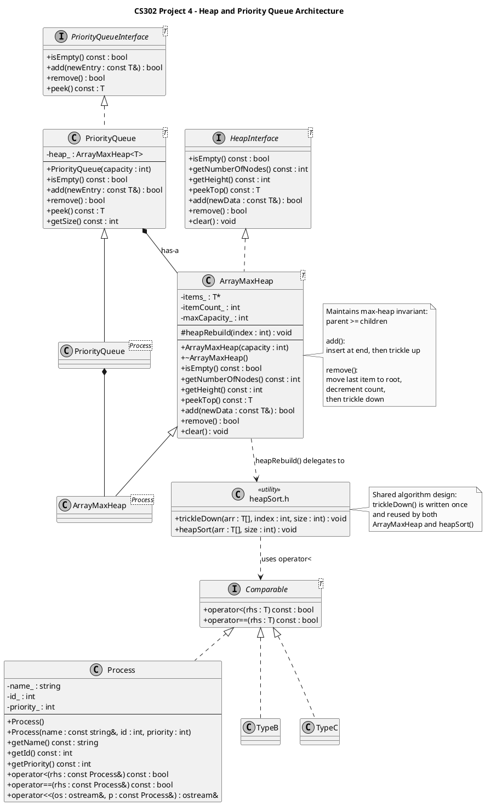

# Design Decisions

## Item Type Choices

## Priority Scales

## operator< Rationale

## trickleDown Design

## Edge Cases

```plantuml
@startuml
title CS302 Project 4 - Heap and Priority Queue Architecture

skinparam classAttributeIconSize 0
skinparam monochrome true

' =========================
' Interfaces
' =========================
interface "Comparable<T>" as ComparableT {
  +operator<(rhs : T) const : bool
  +operator==(rhs : T) const : bool
}

interface "HeapInterface<T>" as HeapInterfaceT {
  +isEmpty() const : bool
  +getNumberOfNodes() const : int
  +getHeight() const : int
  +peekTop() const : T
  +add(newData : const T&) : bool
  +remove() : bool
  +clear() : void
}

interface "PriorityQueueInterface<T>" as PriorityQueueInterfaceT {
  +isEmpty() const : bool
  +add(newEntry : const T&) : bool
  +remove() : bool
  +peek() const : T
}

' =========================
' Item types
' =========================
class Process {
  -name_ : string
  -id_ : int
  -priority_ : int
  --
  +Process()
  +Process(name : const string&, id : int, priority : int)
  +getName() const : string
  +getId() const : int
  +getPriority() const : int
  +operator<(rhs : const Process&) const : bool
  +operator==(rhs : const Process&) const : bool
  +operator<<(os : ostream&, p : const Process&) : ostream&
}


ComparableT <|.. Process
ComparableT <|.. TypeB
ComparableT <|.. TypeC

' =========================
' Core heap class
' =========================
class "ArrayMaxHeap<T>" as ArrayMaxHeapT {
  -items_ : T*
  -itemCount_ : int
  -maxCapacity_ : int
  --
  #heapRebuild(index : int) : void
  --
  +ArrayMaxHeap(capacity : int)
  +~ArrayMaxHeap()
  +isEmpty() const : bool
  +getNumberOfNodes() const : int
  +getHeight() const : int
  +peekTop() const : T
  +add(newData : const T&) : bool
  +remove() : bool
  +clear() : void
}

HeapInterfaceT <|.. ArrayMaxHeapT

' =========================
' Priority queue wrapper
' =========================
class "PriorityQueue<T>" as PriorityQueueT {
  -heap_ : ArrayMaxHeap<T>
  --
  +PriorityQueue(capacity : int)
  +isEmpty() const : bool
  +add(newEntry : const T&) : bool
  +remove() : bool
  +peek() const : T
  +getSize() const : int
}

PriorityQueueInterfaceT <|.. PriorityQueueT
PriorityQueueT *-- ArrayMaxHeapT : has-a

' =========================
' Free functions
' =========================
class "heapSort.h" as HeapSortModule <<utility>> {
  +trickleDown(arr : T[], index : int, size : int) : void
  +heapSort(arr : T[], size : int) : void
}

ArrayMaxHeapT ..> HeapSortModule : heapRebuild() delegates to
HeapSortModule ..> ComparableT : uses operator<

' =========================
' Example instantiations
' =========================
class "PriorityQueue<Process>" as PQProcess
class "ArrayMaxHeap<Process>" as HeapProcess

PriorityQueueT <|-- PQProcess
ArrayMaxHeapT <|-- HeapProcess
PQProcess *-- HeapProcess

note right of ArrayMaxHeapT
Maintains max-heap invariant:
parent >= children

add():
insert at end, then trickle up

remove():
move last item to root,
decrement count,
then trickle down
end note

note right of HeapSortModule
Shared algorithm design:
trickleDown() is written once
and reused by both
ArrayMaxHeap and heapSort()
end note

@enduml

```
